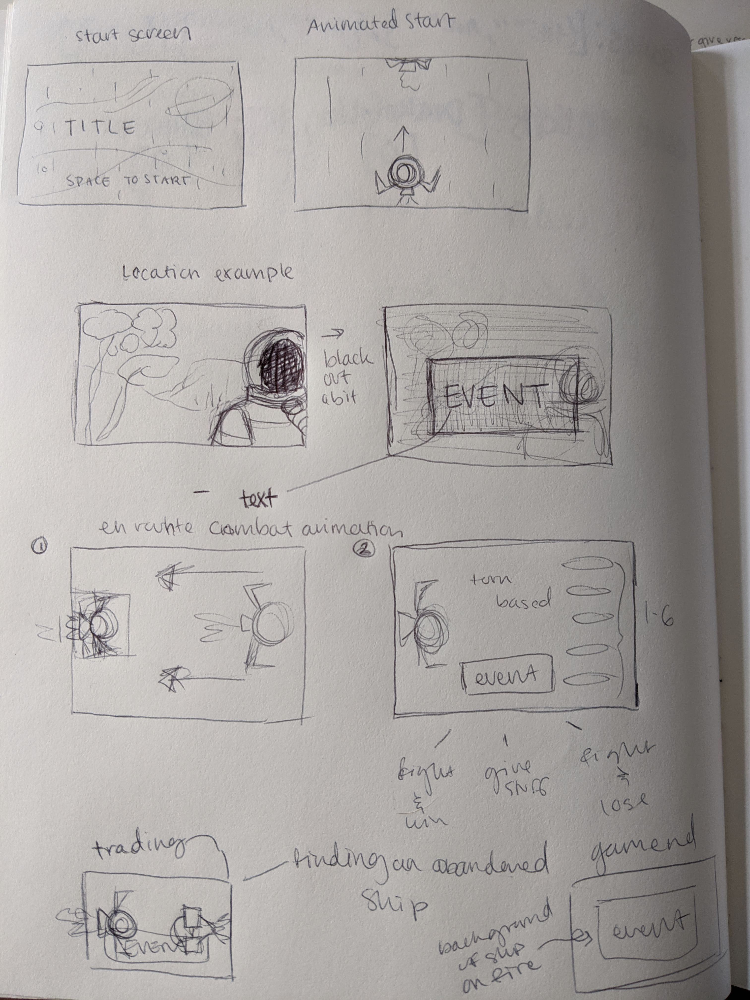

### Game Proposal

# TITLE TBD

### Overview

You're a space explorer trying to reach the final lands of your expedition. On your journey you'll be faced with trials that will challenge your luck and your likelihood you'll even reach your location. 

### Rules of the Game

The player will be faced with random locations (planets) and random events in those locations that will affect your resources (depleting or adding).

__Resources for your ship are:__
- Oxygen
- Hull
- Fuel

After resolving those events the ship will head to the next location. En route another random event will occur that will affect resources.

__Events__
- Combat (1 - 6 enemies with stats that scale down with each alien on screen)
  * can be solved in two ways
    * giving up resources
    * fighting the enemies off
- Trade
- Abandoned ships

This process repeats until one or more of the player's resources reach or tank under 0 (game over). 

Win condition is reaching the last location. 

### Technical Challenges

Displaying things and having click events registered properly on canvas are my biggest concerns as of yet. 

### Wireframe
>> sorry it's rotated I'm not sure how to fix it

### Timeline

__Tuesday__  
`Proposal approval. Pseudocoding. JS implementation.` 
__Wednesday__ 
`Continue JS implementation. Work on assets` 
__Thursday__ 
`Continue JS implementation. Work on assets` 
__Friday__ 
`Continue JS implementation. Work on assets. Stress test.` 
__Saturday__ 
`Continue JS implementation. Work on assets. Stress test.` 
__Sunday__ 
`Continue JS implementation. Work on assets. Find hard stop for implementation and for assets. Stress test.` 
__Monday__ 
`Polish. Submit.` 
