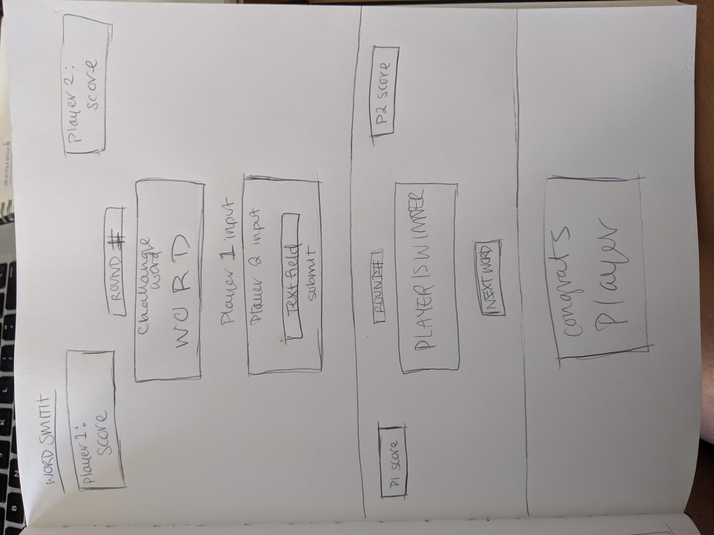
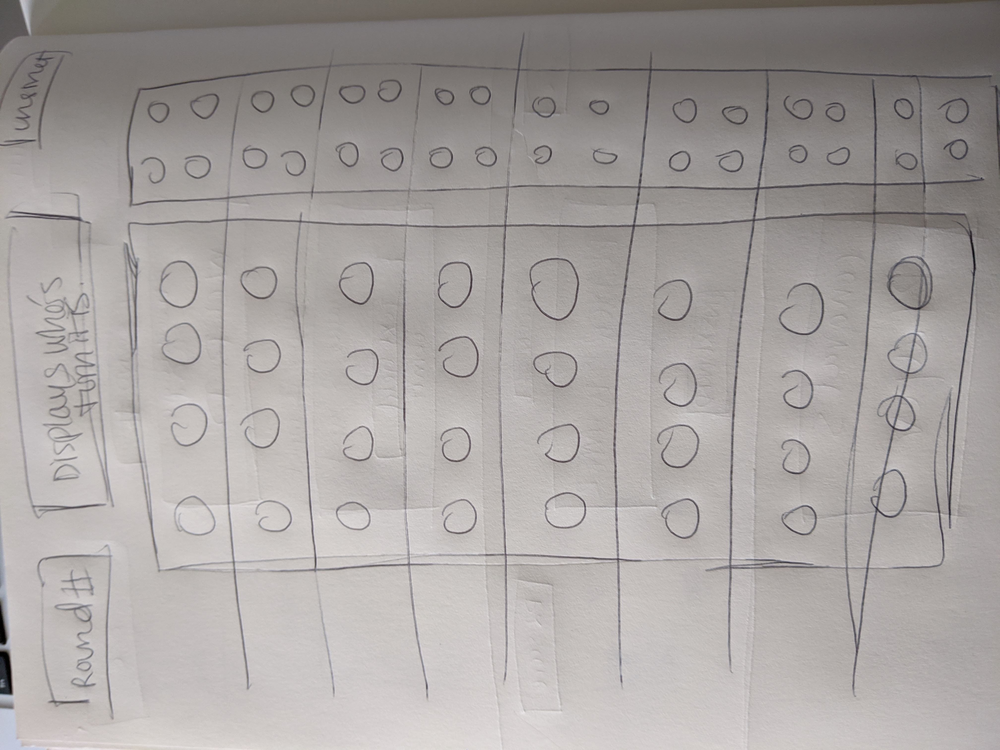

### Game Proposal

# Word Smith

### Rules of the Game

A two player game.

The computer will select a word and display it for the players and then the players will take turns writing in the longest synonym of the displayed word that they know. 

The longest word wins. Scores evaluated at the end of 5 rounds

### Technical Challenges

Trying to get enough words for playability.

### Wireframe

### Timeline

__Tuesday__  
`Proposal approval. Pseudocoding. JS implementation.` 
__Wednesday__ 
`Continue JS implementation. Work on assets` 
__Thursday__ 
`Continue JS implementation. Work on assets` 
__Friday__ 
`Continue JS implementation. Work on assets. Stress test.` 
__Saturday__ 
`Continue JS implementation. Work on assets. Stress test.` 
__Sunday__ 
`Continue JS implementation. Work on assets. Find hard stop for implementation and for assets. Stress test.` 
__Monday__ 
`Polish. Submit.` 

# OR

### Game Proposal

# Mastermind

### Rules of the Game

The game is played using:

The code maker (computer) chooses a pattern of four code pegs. 

The codebreaker tries to guess the pattern, in both order and color, within eight to twelve turns. Each guess is inputted by placing a row of code pegs. Once placed, the code maker (computer) provides feedback by alerting whether or not the codebreaker got the order or the color or both correctly, but not which they got correct.

Once feedback is provided, another guess is made; guesses and feedback continue to alternate until either the codebreaker guesses correctly, or twelve (or ten, or eight) incorrect guesses are made.

### Technical Challenges

Making the DOM display the pegs and the indicators of the code

### Wireframe

### Timeline

__Tuesday__  
`Proposal approval. Pseudocoding. JS implementation.` 
__Wednesday__ 
`Continue JS implementation. Work on assets` 
__Thursday__ 
`Continue JS implementation. Work on assets` 
__Friday__ 
`Continue JS implementation. Work on assets. Stress test.` 
__Saturday__ 
`Continue JS implementation. Work on assets. Stress test.` 
__Sunday__ 
`Continue JS implementation. Work on assets. Find hard stop for implementation and for assets. Stress test.` 
__Monday__ 
`Polish. Submit.` 